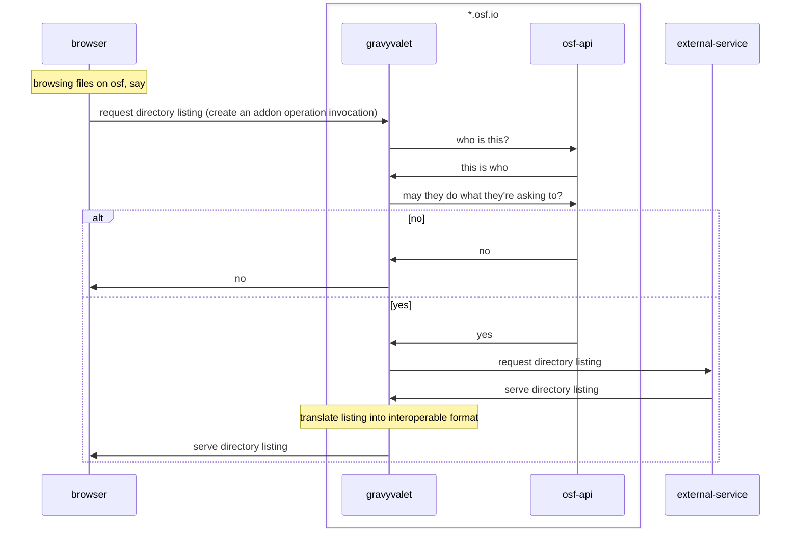
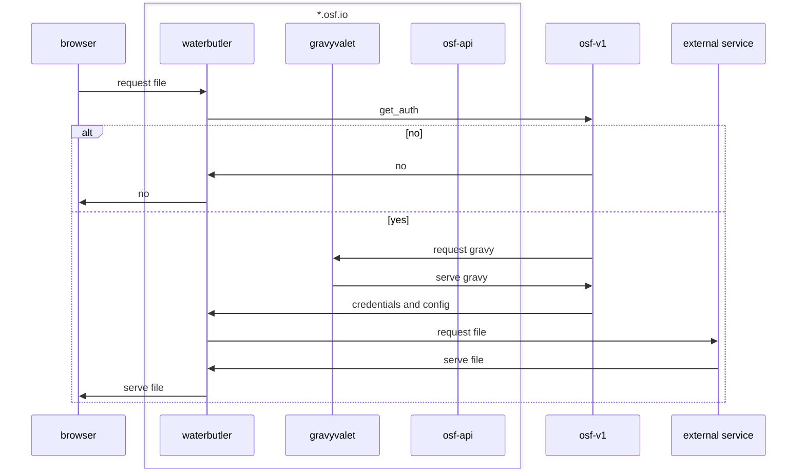
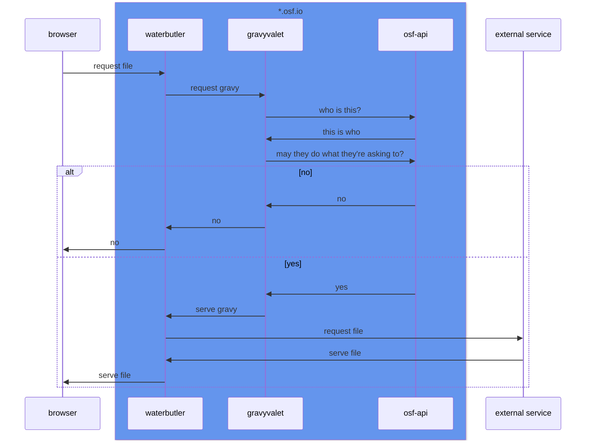

# gravyvalet architecture

## code layout
- addon_toolkit
    - defines shared interfaces and helpful utilites for concrete addon imps and addon services
- addon_imps
    - addon implementations
- addon_service
    - 

## network flows

addon operation invocation thru gravyvalet (as currently implemented with osf)

download a file thru waterbutler, with get_auth and gravyvalet (as currently implemented)

hypothetical world where waterbutler talks to gravyvalet... is this better than get_auth?

