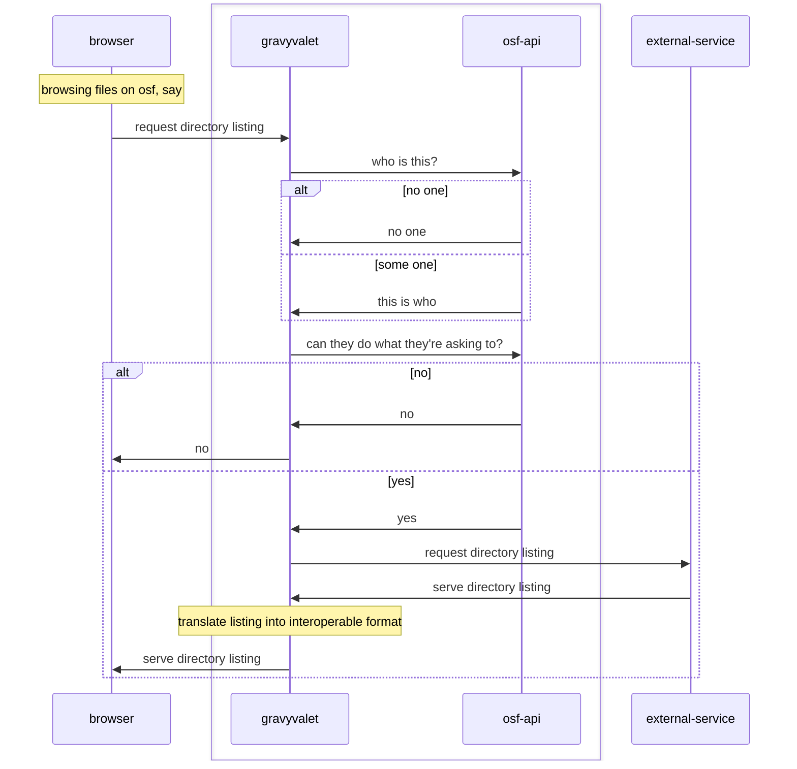

# TODO: gravyvalet code docs

## README.md
- brief summary
- links to all other docs

## ARCHITECTURE.md
- code layout
- concepts and relationships
- sequence diagrams

as currently implemented


hypothetical world where waterbutler talks to gravyvalet... is this any better?
```mermaid
sequenceDiagram
    participant browser
    Box #badbee *.osf.io
        participant waterbutler
        participant gravyvalet
        participant osf-api
    end
    browser->>waterbutler: request file
    waterbutler>>gravyvalet: request gravy
    gravyvalet->>osf-api: who is this?
    osf-api->>gravyvalet: this is who
    gravyvalet->>osf-api: can they do what they're asking to?
    alt no
        osf-api->>gravyvalet: no
        gravyvalet->>browser: no
    else yes
        osf-api->>gravyvalet: yes
        gravyvalet->>external-service: request directory listing
        external-service->>gravyvalet: serve directory listing
        Note over gravyvalet: translate listing into interoperable format
        gravyvalet->>browser: serve directory listing
    end
    gravyvalet->>waterbutler: serve gravy
    waterbutler>>external service: request file
    external service->>waterbutler: serve file
    waterbutler>>browser: serve file
```


## how-to/local_setup_with_osf.md
- with gravyvalet docker-compose.yml
- with osf.io docker-compose.yml
- without docker?

## how-to/new_imp_interface.md
- defining interface with operations
- required adds to addon_service

## how-to/migrating_osf_addon_to_imp.md
- implementing imp
- current limitations

## how-to/new_storage_imp.md
- implementing imp
- required changes to waterbutler? (with mention of ideal "none")

## how-to/key_rotation.md
- credentials encryption overview
- secret and prior secrets
- scrypt configuration

## how-to/deployment_environment.md
- all environment variables
- link app/env.py
