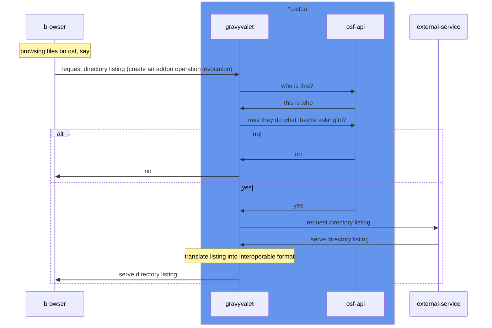
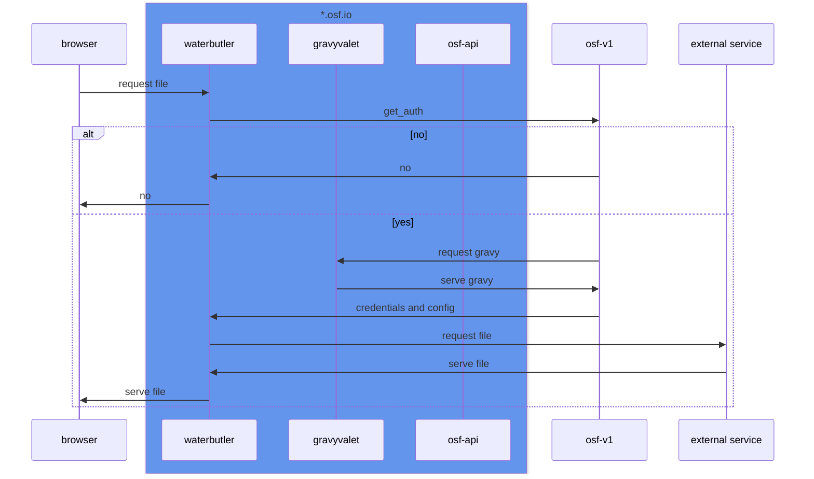
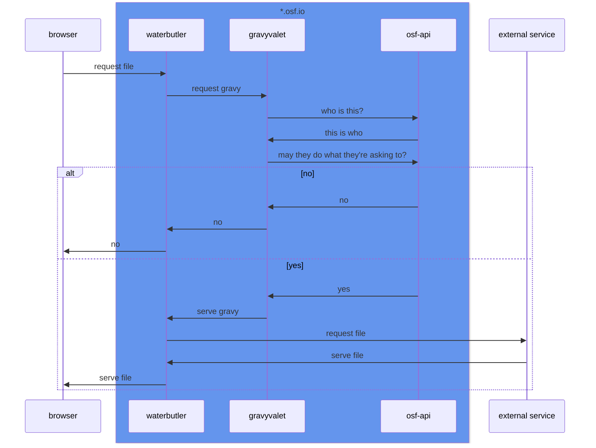

# TODO: gravyvalet code docs

## README.md
- brief summary
- links to all other docs

## ARCHITECTURE.md
- code layout
- concepts and relationships
- sequence diagrams

addon operation invocation thru gravyvalet (as currently implemented)

download a file thru waterbutler, with get_auth and gravyvalet (as currently implemented)

hypothetical world where waterbutler talks to gravyvalet... is this better than get_auth?

## how-to/local_setup_with_osf.md
- with gravyvalet docker-compose.yml
- with osf.io docker-compose.yml
- without docker?

## how-to/new_imp_interface.md
- defining interface with operations
- required adds to addon_service

## how-to/migrating_osf_addon_to_imp.md
- implementing imp
- current limitations

## how-to/new_storage_imp.md
- implementing imp
- required changes to waterbutler? (with mention of ideal "none")

## how-to/key_rotation.md
- credentials encryption overview
- secret and prior secrets
- scrypt configuration

## how-to/deployment_environment.md
- all environment variables
- link app/env.py
