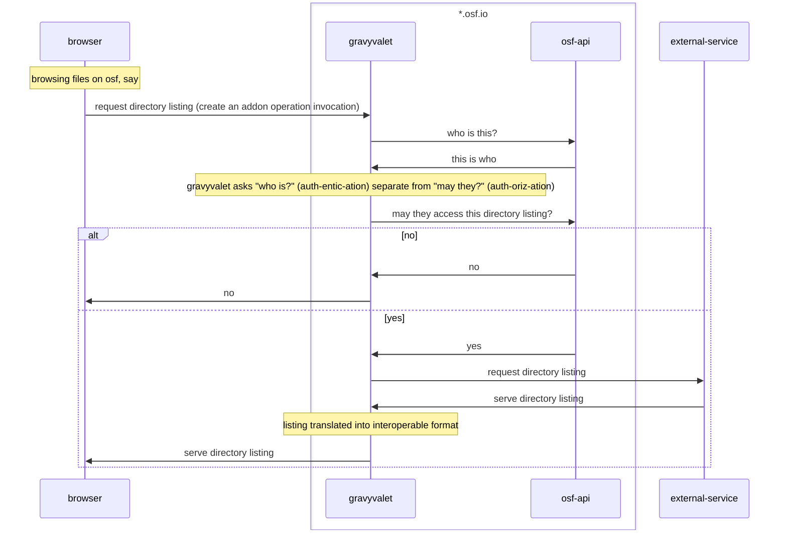
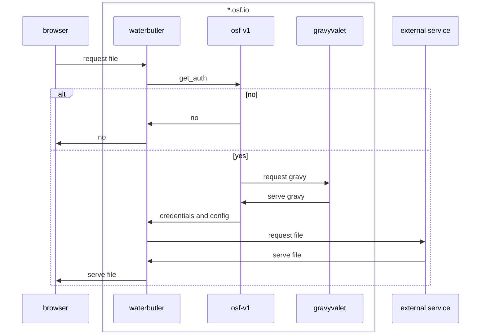
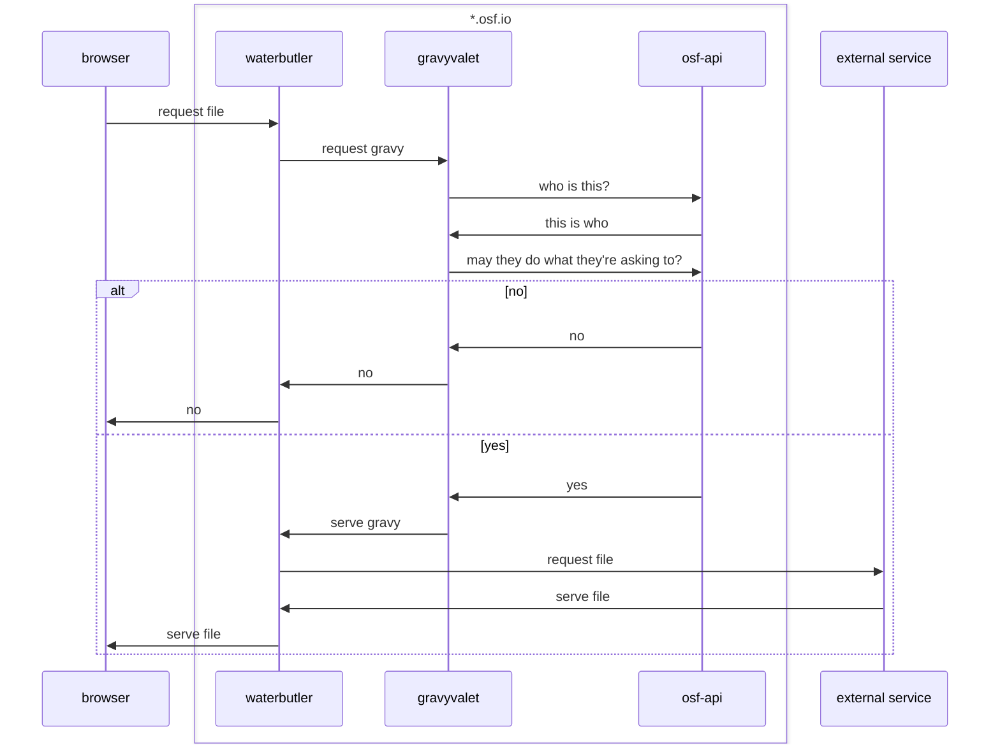

# addon_service: a django app for the gravyvalet web api

## network flows

addon operation invocation thru gravyvalet (as currently implemented with osf)

download a file thru waterbutler, with get_auth and gravyvalet (as currently implemented)

hypothetical world where waterbutler talks to gravyvalet... is this better than get_auth?

